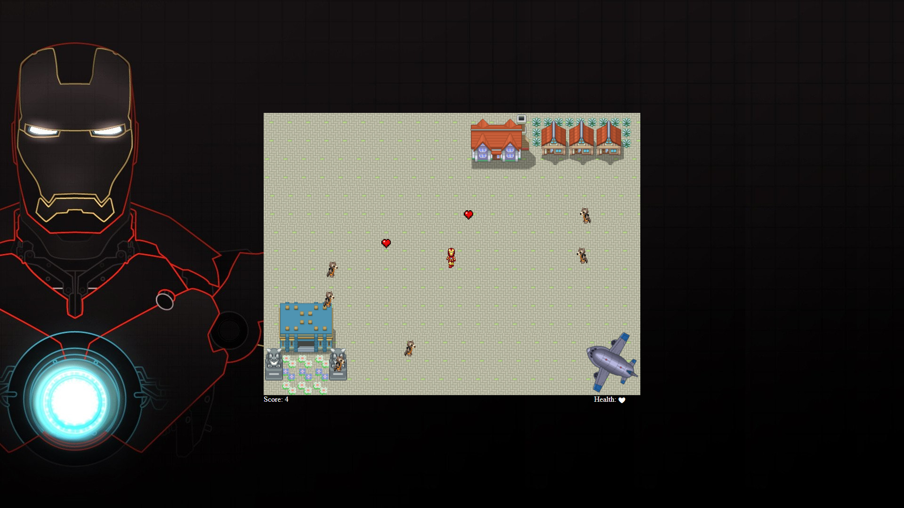

# Iron-shooter

A 2d browser game made with JavaScript, taking into character _Iron Man_.

### Project Infos
* **Date:** May 2021
* **Project idea:** Have fun and play around with the JavaScript language
* **Game objective:** Kill as many enemies as possible, the more you kill higher the score will be, catch the floating hearts in order to recover hp from enemy collision and enjoy :smile:
* **Instructions:** Use the **W**, **A**, **S**, **D** keys to move the player, the **mouse** to aim and left click to shoot

### Disclaimer
This repository corresponds to a personal project. I do not take any responsibility over any code faults and do not take any credit for the sprites and sounds displayed throughout the game.

## Screenshots

* Full Game View

